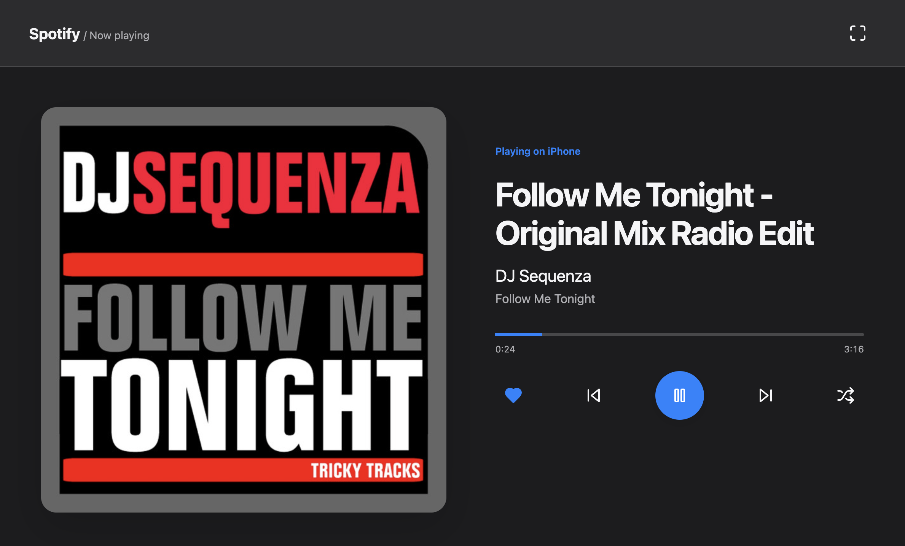
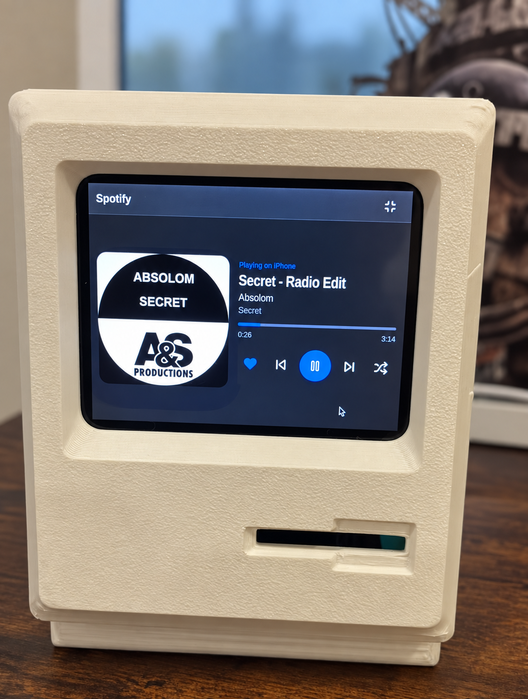

# Spotipy Visualizer — Spotify Now Playing Display for Raspberry Pi

**A self-hosted Spotify album art display with playback controls, automatic themes, and a clock screensaver.**


[](LICENSE)

Spotipy Visualizer turns a **Raspberry Pi touchscreen**, tablet browser, or Linux desktop into a fullscreen **Spotify now playing display**. Show album artwork, song titles, and artists beside touch-friendly playback controls. Build a dedicated music dashboard for your desk or hi-fi setup, with macOS-inspired and classic themes that switch between light and dark on a schedule.

Built with **Python, Flask, and Spotipy**, the app reads playback state through the **Spotify Web API** and runs locally as a Python application or Linux snap. **Music plays on your existing Spotify device**; this application displays playback information and sends control commands. It does not stream audio or generate audio-reactive visual effects.



<p align="center">
  
  <br>
  <em>A dedicated desktop display. Photo enhanced for clarity. The enclosure is from the <a href="https://www.printables.com/model/1259764-raspberry-pi-5-macintosh-plus">Raspberry Pi 5 Macintosh Plus model on Printables</a>.</em>
</p>

[Quick start](#quick-start) · [Spotify setup](#connect-spotify) · [Snap installation](#snap-installation) · [Themes](#themes-and-scheduling) · [FAQ](#frequently-asked-questions) · [Troubleshooting](#troubleshooting) · [License](#license-and-credit)

## Spotify display features

- Large album artwork with song, artist, album, and active device information.
- Play/pause, previous/next track, shuffle, and like/unlike controls.
- Playback progress and elapsed/total time.
- Responsive layout with touch controls and a fullscreen button.
- Four themes: macOS light/dark and classic light/dark.
- Automatic daytime/nighttime themes with configurable hours and timezone.
- A matching clock screensaver after five minutes of paused or stopped music.
- Separate Spotify credentials and appearance configuration.
- Snap background service and desktop browser launcher, including a launch path for Raspberry Pi OS Trixie/Wayland.

## Build a dedicated Spotify display

- **Raspberry Pi music dashboard:** show album art and control the Spotify device already playing your music.
- **Touchscreen desk display:** use large playback buttons and fullscreen artwork beside your computer or hi-fi system.
- **Tablet or spare monitor:** open the player in a browser on your trusted local network.
- **Retro Macintosh-style project:** pair the interface with the [Raspberry Pi 5 Macintosh Plus enclosure](https://www.printables.com/model/1259764-raspberry-pi-5-macintosh-plus) shown above.

## Requirements: Spotify account, Python, and a browser

You need a modern browser, an internet connection, a Spotify developer application, and an account permitted to use that application. Spotify currently requires the app owner to have Premium for Development Mode; playback control also requires Premium. Review [Spotify's Development Mode requirements](https://developer.spotify.com/documentation/web-api/tutorials/february-2026-migration-guide) for account and access limits.

For source installation, use Python 3 with `venv` and `pip`. Development tests run with Python 3.13. For a snap installation, you need snapd and a package matching your system architecture. A physical Raspberry Pi display is optional: any browser on the trusted local network can show the player.

<a id="quick-start"></a>

## Quick start: Raspberry Pi and Linux installation

Download or clone this repository, then open a terminal in its directory. On Raspberry Pi OS/Debian, install the Python prerequisites if needed:

```sh
sudo apt update
sudo apt install python3 python3-venv python3-pip
```

Start the application:

```sh
./run_local.sh
```

This creates `.venv`, installs dependencies from `requirements.txt`, and starts the server. On first startup, configuration files are created without overwriting existing settings.

1. Complete [Spotify setup](#connect-spotify) below, editing `Flask/spotify.ini`.
2. Open **http://127.0.0.1:60123** on the server computer.
3. Click **Connect Spotify** and authorize your account.
4. Start a song in Spotify on your phone, computer, or speaker.
5. Click the fullscreen button to fill your display.

Leave the terminal running; press `Ctrl+C` to stop. For other devices on your LAN, use `http://SERVER_LAN_IP:60123`. The default listener is `0.0.0.0`; use `HOST=127.0.0.1 ./run_local.sh` for local-only access.

<a id="connect-spotify"></a>

## Connect Spotify: Web API credentials and authorization

Create an application in the [Spotify developer dashboard](https://developer.spotify.com/dashboard) and register this exact redirect URI:

```text
http://127.0.0.1:60123/auth/callback
```

Edit the configuration for your installation:

| Installation | Spotify configuration |
| --- | --- |
| Source | `Flask/spotify.ini` |
| Snap | `/var/snap/spotipy-visualizer/common/Flask/spotify.ini` |

```ini
[spotify]
client_id = YOUR_SPOTIFY_CLIENT_ID
client_secret = YOUR_SPOTIFY_CLIENT_SECRET
redirect_uri = http://127.0.0.1:60123/auth/callback
```

Add other allowed accounts to your developer app's user access list as needed. Credentials are reread on requests, so editing this file does not require a restart.

Use `127.0.0.1`, not `localhost`. Spotify permits HTTP loopback callbacks but requires HTTPS for non-loopback callbacks; see [redirect URI rules](https://developer.spotify.com/documentation/web-api/concepts/redirect_uri). If you change the server port, update both the configuration and the registered callback.

### Authorizing a headless Pi

From a computer with a browser, open an SSH tunnel:

```sh
ssh -L 60123:127.0.0.1:60123 user@SERVER_IP
```

Keep it running while you visit `http://127.0.0.1:60123` on that computer and authorize Spotify. Once connected, the display can use the server's LAN address normally.

For an HTTPS reverse proxy, register an HTTPS callback ending in `/auth/callback`, preserve the Host header, and forward `X-Forwarded-Proto: https`. Set `TRUSTED_PROXY` to the proxy's IP address.

## Snap installation

Install the locally built package matching your architecture. For example, on a 64-bit ARM system:

```sh
sudo snap install --dangerous ./spotipy-visualizer_1.0.3_arm64.snap
sudoedit /var/snap/spotipy-visualizer/common/Flask/spotify.ini
```

`--dangerous` allows installation of a local snap without a store assertion. The install hook creates **both** `spotify.ini` and `theme.conf` from their bundled examples, with mode `0600`, only when missing. Existing configurations are preserved. The hook does not start Python; snapd manages the background service.

Open **Spotipy Visualizer** from the desktop applications menu, or run:

```sh
spotipy-visualizer.desktop-launch
```

Useful service commands:

```sh
sudo snap services spotipy-visualizer
sudo snap logs spotipy-visualizer.flask-server
sudo snap restart spotipy-visualizer.flask-server
```

The launcher asks the host desktop to open its default browser using `snapctl user-open`. It requires an active desktop session, a configured browser, and the `desktop` interface. Source users can run `./shscripts/desktop-launch` after starting the server; it tries `xdg-open`, `gio open`, then installed browsers. If using a custom `PORT`, pass the same value to the server and launcher.

### Build a snap

With Snapcraft and a suitable build environment installed, run from the repository root:

```sh
snapcraft pack
```

The manifest defines version `1.0.3` and multiple target architectures. Availability of a declaration is not a claim that every architecture has been tested. Rebuild after changing code or package metadata; an existing `.snap` file does not update automatically.

`spotipy-visualizer` is a different snap identity from the earlier `spotify-visualizer` package. Its data directory is separate; moving to the new name does not automatically transfer the old package's configuration or authorization.

<a id="themes-and-scheduling"></a>

## Light and dark themes: macOS, classic, and automatic scheduling

Edit `Flask/theme.conf` for source runs, or `/var/snap/spotipy-visualizer/common/Flask/theme.conf` for snaps. See the complete [configuration template](Flask/theme.conf.example).

| Theme name | Appearance |
| --- | --- |
| `macos-light` | Light gray background, blue controls, rounded artwork |
| `macos-dark` | Dark gray background, blue controls, rounded artwork |
| `classic-light` | Light background, green accents, classic layout |
| `classic-dark` | Original dark background and green accents |

The default configuration uses light from **06:00 to 18:00**, then dark overnight:

```ini
[theme]
mode = auto
name = macos-light
light_theme = macos-light
dark_theme = macos-dark
light_start = 06:00
dark_start = 18:00
timezone =
```

- `mode = auto` selects `light_theme` or `dark_theme` using the schedule.
- `mode = manual` uses `name` all day.
- Times use 24-hour `HH:MM`. Overnight light windows are supported; equal start times mean light all day.
- A blank `timezone` uses the server/Pi's local timezone. Use an IANA name such as `Europe/Rome` to override it, including seasonal clock changes.
- Invalid times fall back to `06:00`/`18:00`; an invalid timezone falls back to server local time.

For classic automatic switching, set `light_theme = classic-light` and `dark_theme = classic-dark`. The legacy names `macos` and `classic` remain aliases for `macos-light` and `classic-dark`. Old files without `mode` retain manual selection.

Optional settings are `accent`, `background`, `foreground`, `muted`, `surface`, `border`, and `hover` (six-digit hex colors), plus `artwork_radius` (0–48 pixels). Overrides apply to both scheduled themes; leave them blank to retain each palette.

**An open player applies changes within 30 seconds**, without restarting the server or refreshing the page.

## Clock screensaver

After five minutes of confirmed paused or stopped playback with no interaction,
the player gives way to a large clock and date. The macOS themes use thin clock
typography and a soft background; classic themes use a bolder clock and their
existing palette. The screensaver follows the same automatic light/dark schedule,
color overrides, and server/configured timezone as the player.

Music resuming returns to the player on the next playback poll (normally within the configured
idle polling interval (60 seconds by default)). Tap, move the mouse, scroll, or press a key to wake it manually;
this starts a fresh five-minute idle period. The wake-up tap does not activate a
player control. Playback and theme polling continue while the clock is visible.
Setup and connection errors keep the player visible instead of hiding behind the
clock. A subtle clock drift is disabled when reduced motion is requested.

The screensaver stays inside the browser and preserves fullscreen mode. It does
not change the operating system's screen blanking or power-management settings.

## Spotify request limits and tuning

Spotify counts requests in an app-wide rolling 30-second window. The allowance
varies by quota mode, and some endpoints have additional limits. Spotify does
not publish a universal safe request count; other instances using the same
client ID share that allowance. See [Spotify rate limits](https://developer.spotify.com/documentation/web-api/concepts/rate-limits).

The `[rate_limit]` section of `spotify.ini` contains these local safety settings:

```ini
[rate_limit]
playback_poll_seconds = 15
idle_poll_seconds = 60
liked_cache_seconds = 600
max_requests_per_30_seconds = 8
control_interval_seconds = 2
retry_after_fallback_seconds = 60
retry_after_buffer_seconds = 2
```

Playback reads are cached across all browser displays connected to this server.
Playing-track progress continues locally between reads. Liked status is cached
per track; likes changed through this app update the cache immediately. Changes
made in another Spotify app may take up to the cache interval to appear.
The server tells each browser when to poll again. Paused/idle polling is slower,
so detecting playback started elsewhere can take up to 60 seconds by default.

All Web API reads and controls share the local 30-second budget. Control commands
also have a minimum interval; commands rejected by these local limits are not
queued or automatically replayed. OAuth authorization/token exchanges are separate
from this Web API budget. Separate server processes do not share the local budget.

On a Spotify HTTP 429, the server and browsers stop requesting playback/control
until `Retry-After` plus the safety buffer has elapsed, even for long cooldowns.
If the header is missing or invalid, the fallback increases on repeated 429s.
Each Spotify 429 also doubles playback/idle intervals, up to eight times the
configured values for that server session. A cooldown is saved privately in
`.spotify-rate-limit.json` and restored after a restart; restarting does not
bypass it. The last displayed track stays visible with a status message while
controls wait for the cooldown.

Increase polling/cache intervals or lower the request budget if limits recur.
The defaults reduce traffic but cannot guarantee that Spotify never returns 429.
Invalid/out-of-range values fall back to the documented defaults; see the
comments in [spotify.ini.example](Flask/spotify.ini.example) for accepted ranges.
Edits are reread on requests and do not require restarting the server.

On startup after an upgrade, missing tuning keys are added automatically with
comments and defaults. Existing credentials, custom values, comments, and other
sections are retained. Malformed configuration files are left untouched for
manual correction. The upgrade runs when the server starts, including after a
snap refresh; the install hook still preserves existing files.

## Configuration and storage

| Setting | Default | Purpose |
| --- | --- | --- |
| `HOST` | `0.0.0.0` | Server listening address |
| `PORT` | `60123` | HTTP port; must match your callback configuration |
| `SNAP_COMMON` | Unset outside snaps | When set, data goes under `$SNAP_COMMON/Flask` |
| `TRUSTED_PROXY` | Unset | IP address of a trusted HTTPS reverse proxy |

Outside snaps, data lives alongside the Python application in `Flask/`. Inside snaps, data lives in `/var/snap/spotipy-visualizer/common/Flask/`, shared across revisions. Code and static assets are read from the installed package. Legacy revision-local credentials, tokens, and session keys are copied to common storage only when missing.

Credentials, `.spotify-token.json`, and `.session-key` are stored outside static assets with mode `0600`. Keep these files private and out of commits. When switching accounts or developer apps, stop the server, remove only `.spotify-token.json` from the relevant data directory, restart, and reconnect.

This is a **single-account application for a trusted LAN**. Anyone who can reach the server can view playback and use its controls. Add access control before exposing it beyond that network. Control routes reject cross-origin browser requests; OAuth uses state validation.

## Frequently asked questions

### Can I use a Raspberry Pi as a Spotify album art display?

Yes. Run Spotipy Visualizer on the Pi, connect your Spotify account, and open the
local player in a browser. A touchscreen adds direct playback controls; a regular
monitor works too. Follow the [Raspberry Pi installation steps](#quick-start).

### Does this app play music or replace Spotify Connect?

It controls an existing Spotify playback device through the Web API. It does not
stream audio, turn the Pi into a Spotify Connect receiver, or replace the Spotify
app. Start music on your phone, computer, or speaker, then use this display to
view and control playback.

### Is this an audio-reactive music visualizer?

The visualization is a now-playing dashboard with album artwork and track
information. It does not analyze audio or draw spectrum bars or waveforms.

### Does it need a Raspberry Pi or a touchscreen?

No. The server can run on another suitable Python/Linux machine, and the display
can be a desktop or tablet browser. A touchscreen and the pictured enclosure are
optional. The desktop launcher includes support for Raspberry Pi OS Trixie sessions.

### Can the display switch to a clock when Spotify is paused?

Yes. After five minutes of paused or stopped playback without interaction, the
[clock screensaver](#clock-screensaver) appears. It follows the selected theme,
light/dark schedule, and timezone, and wakes when playback resumes or you interact.

### Do I need Spotify Premium and my own developer app?

You need developer credentials and an authorized account. See the
[requirements](#requirements-spotify-account-python-and-a-browser) and
[Spotify setup](#connect-spotify) sections for Premium and developer-access details.

## Troubleshooting

| Symptom | What to check |
| --- | --- |
| Spotify setup message | Fill in `client_id`, `client_secret`, and a valid `redirect_uri`. |
| Login or callback fails | Match the dashboard callback exactly; use the SSH tunnel for headless setup. |
| Nothing playing / controls disabled | Start playback on a Spotify device; restricted devices can disable controls. |
| Spotify denies an action | Check Premium, developer app access, and device restrictions. |
| Theme changes at the wrong time | Check the Pi clock, timezone, `mode`, and schedule; wait up to 30 seconds. |
| Desktop launcher fails | Confirm the service is running, the desktop has a default browser, and `snap connections spotipy-visualizer` shows `desktop` connected. Try the URL directly. |
| Another device cannot connect | Check the LAN address, listener setting, and firewall access to port `60123`. |
| Rate-limit message | Let the player retry; repeated manual requests can prolong the problem. |

## Development and contributions

To install dependencies, run checks, and start the app:

```sh
./run.sh
```

To run checks without starting the server:

```sh
./run.sh --test-only
```

If dependencies are already installed:

```sh
.venv/bin/python -m unittest discover -s tests -v
```

Optional browser checks for the clock (requires Playwright and Chromium):

```sh
.venv/bin/python -m pip install playwright
.venv/bin/python tests/browser_screensaver.py
.venv/bin/python tests/browser_rate_limits.py
```

These use mocked playback and an accelerated browser clock to verify the idle
delay, wake-up, all four palettes, timezone, touch, a small display, and browser
polling/cooldown behavior.

Tests cover playback/control routes with mocked Spotify calls, authorization checks, configuration persistence, launcher dispatch, theme palettes, and schedule boundaries. They do not replace live Spotify or Raspberry Pi desktop testing.

| Location | Contents |
| --- | --- |
| `Flask/app.py` | Application factory and Waitress startup |
| `Flask/spotify_player.py` | Spotify authorization, state, and controls |
| `Flask/theme.py` | Theme configuration and scheduled CSS |
| `Flask/static/` | Browser interface and bundled icons |
| `snap/`, `snapcraft.yaml` | Packaging, install hook, desktop entry |
| `shscripts/` | Server and desktop launchers |
| `tests/` | Automated tests |

Issues and pull requests are welcome. Include your OS, installation method, reproduction steps, and relevant logs with credentials and tokens removed. For UI changes, include screenshots; for behavior changes, run the tests and describe what you verified.

## License and credit

Copyright © 2020–2026 [mauringo](https://github.com/mauringo).

The current project is licensed under **GNU GPL version 3 only** (`GPL-3.0-only`); see [LICENSE](LICENSE) and [NOTICE](NOTICE). Preserve copyright and license notices, identify modifications, and provide corresponding source under the GPL when distributing covered modified versions or binaries. Commercial use is permitted. This is a copyleft license, with stronger redistribution obligations than MIT; see the [GPLv3 overview](https://choosealicense.com/licenses/gpl-3.0/).

For a visible project credit, use **“Based on Spotipy Visualizer by mauringo.”** This is a suggested credit line, not an additional advertising requirement. The license requires preservation of legal notices, not a mention in every use or social post.

Earlier MIT releases retain their original permissions; the historical notice is preserved in [LICENSES/legacy-MIT.txt](LICENSES/legacy-MIT.txt). Third-party components keep their own licenses, including the bundled [Lucide/Feather notices](Flask/static/lucide.LICENSE). Album artwork and Spotify branding shown in the images belong to their respective owners and are not relicensed here.

The 3D-printed enclosure shown in the photo is from [Raspberry Pi 5 Macintosh Plus on Printables](https://www.printables.com/model/1259764-raspberry-pi-5-macintosh-plus). Credit for the enclosure design belongs to its creator; see the model page for its license and printing details. The enclosure design is not covered by this software’s GPL license.

Independent project; not affiliated with or endorsed by Spotify or Apple. The photo enhancement used the built-in imagegen tool; its [editing record](docs/images/EDITING.md) includes the prompt, and the original photos remain in the repository.
